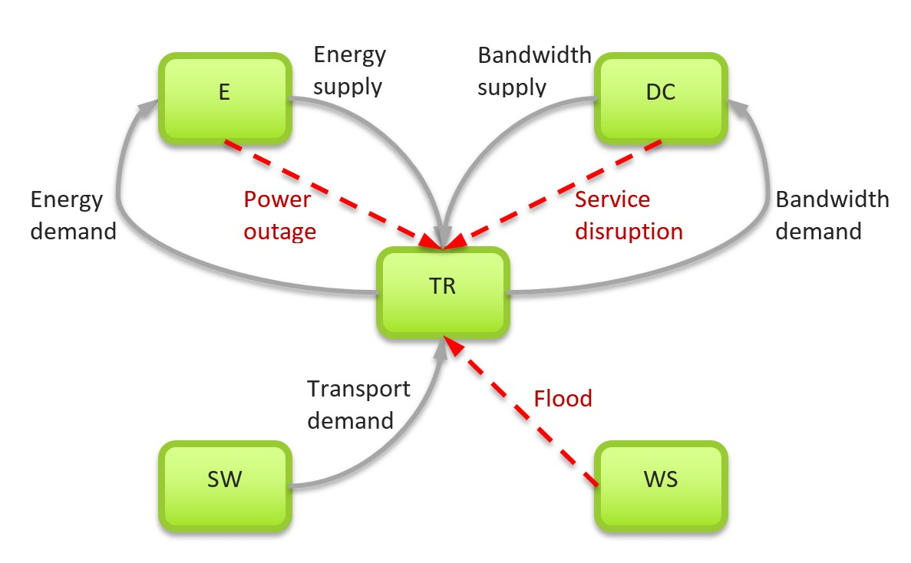
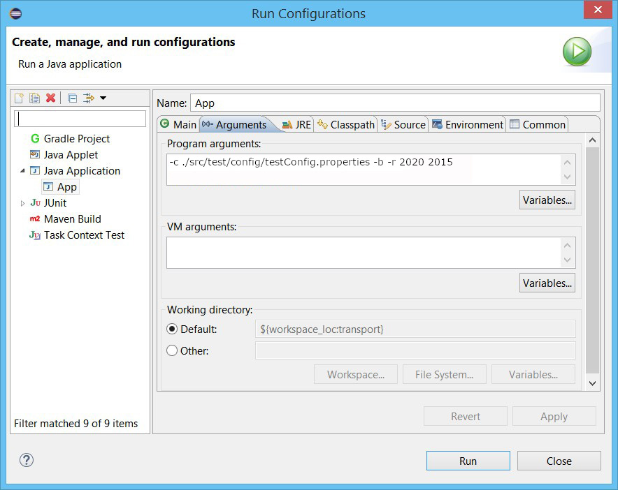

# Transport

This is the home of the transport model code for NISMOD v2.0.0.

## Description

The new transport model forecasts the impact of endogenous and exogenous factors on transport demand and capacity utilisation, following an elasticity-based simulation methodology similar to the original ITRC transport model. The new model is explicitly network-based, which means that the demand is assigned to the network to obtain more accurate predictions of travel times and capacity utilisation.

The transport sector has various links with other sectors:
* Energy: energy consumption, fuel price, electrification of vehicles, fuel transport, power outage (rail and air disruption).
* Digital Communications: supporting smart mobility (e.g. mobility as a service, autonomous mobility on demand), coverage and service disruptions.
* Water Supply: floods causing road and rail disruptions.
* Solid Waste: waste transport (e.g. waste exports through seaports).

The model is currently focusing on interdependencies with the energy sector:
* The fuel price from the energy sector is used in the traffic flow prediction.
* The transport model provides information about fuel consumption to the energy sector.

The implementation uses an open source library *GeoTools* for geospatial processing:
http://www.geotools.org/about.html

Test resources contain a small amount of data and shapefiles that come with the following licencing and copyright statemens:
* Open Government Licence (http://www.nationalarchives.gov.uk/doc/open-government-licence/version/3/).
* Contains National Statistics data © Crown copyright and database right 2012.
* Contains Ordnance Survey data © Crown copyright and database right 2012.
These files are used in the test classes and should also be consulted to understand the required formats of the input files.

## Contact information

* Milan Lovric lovric.milan@gmail.com / M.Lovric@soton.ac.uk (Modelling and development)
* Manuel Buitrago mbm1d15@soton.ac.uk (Seaports and freight)
* Simon Blainey S.P.Blainey@soton.ac.uk (MISTRAL Co-Lead)

## How to run the model

0. Install Java Development Kit version 8 from: http://www.oracle.com.
1. Install *Eclipse IDE for Java Developers*: https://eclipse.org/downloads/.
2. Run Eclipse and choose the workspace folder.
3. Import the existing Maven project from the local git folder where the code has been cloned. In Eclipse: *File -> Import -> Maven -> Existing Maven Projects.* Wait until all Maven dependencies (specified in the *pom.xml* file) are downloaded. If the *pom.xml* file has been changed, the Maven project should be first updated (*Alt+F5*).
4. The classes containing the *main* method can be run as a Java application. The classes containing the methods annotated with *@Test* can be run as *JUnit* tests.
5. To run the main model in Eclipse, open the *Run Configuration* for *nismod.transport.App.java* and pass the path to the config file as an argument:

6. Alternatively, to build the project and run the main model in the command prompt:
 * Make sure the java home environment variable is set for the operating system and pointing to the directory where Java Development Kit has been installed.
 * Download maven, install it and set the environment variables: http://maven.apache.org/. Then type:
 * `mvn clean install`
 * `java -cp target/transport-0.0.1-SNAPSHOT-main-jar-with-dependencies.jar nismod.transport.App -c ./path/to/config.properties`

## Deploy the model for NISMOD

Tag the model version for release:

     git tag -a v2.0.0-alpha-2 -m "Alpha release for NISMOD 2.0.1"

Build jar containing all dependencies and zip (see `Makefile` for details):

    make

Upload model and test data to the NISMOD file server, update the
[`nismod/nismod`](https://github.com/nismod/nismod) configuration and provision
script as necessary.

## How to generate docs

1. Install [javasphinx](http://bronto.github.io/javasphinx/)

    `$ pip install javasphinx`

2. Generate java API docs

    `javasphinx-apidoc -o docs/ --title='transport' transport/src/main/java/`

3. Build documentation

    `sphinx-build -b html docs/ docs/build/`

Documentation can now be opened from `docs/build/index.html`
