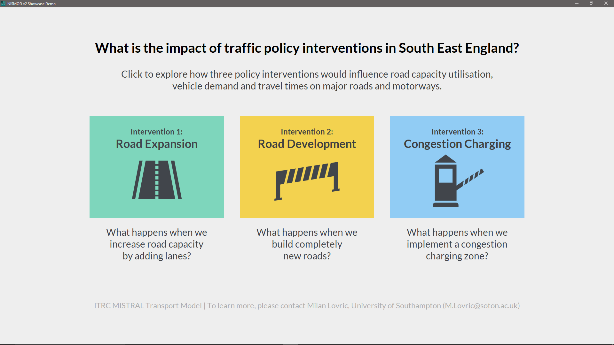
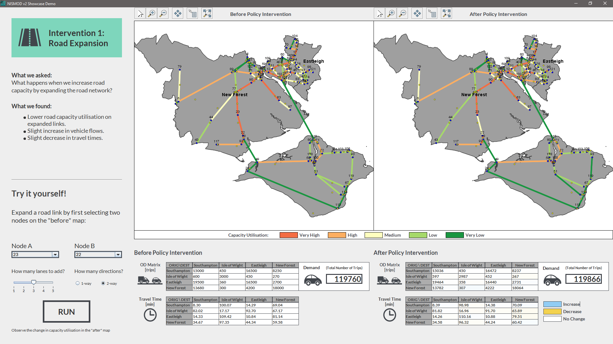
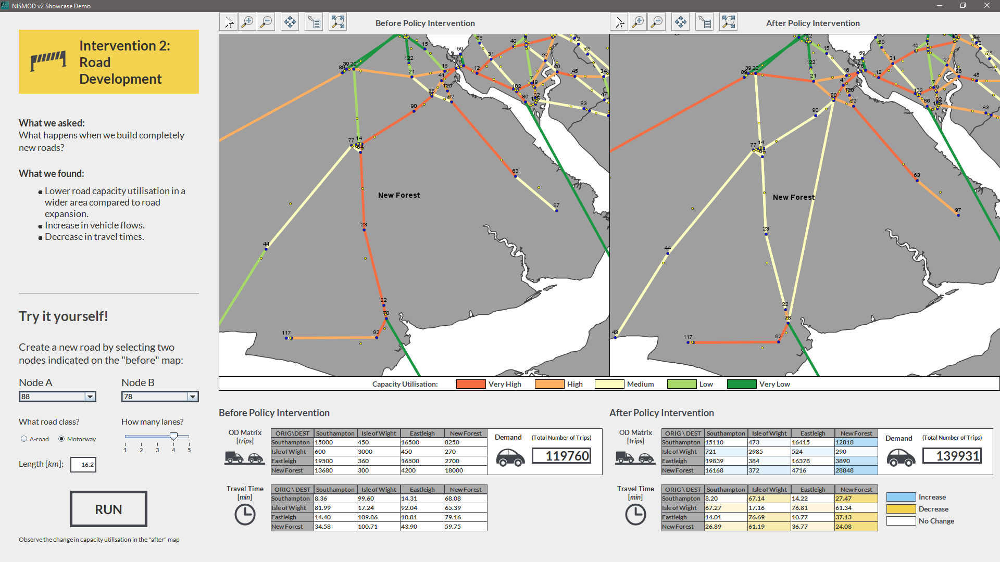
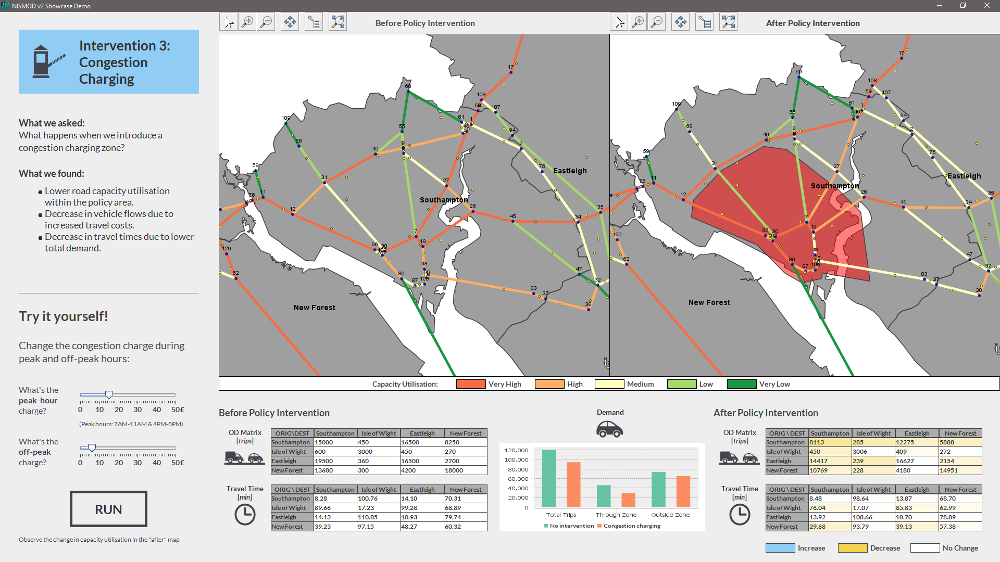

# Transport

This is the home of the NISMOD v2 Transport Model.

## Description

NISMOD v2 Transport Model is a national-scale (*Great Britain*) transport model developed to support policy making regarding the future infrastructure. It forecasts the impact of various endogenous and exogenous factors on transport demand and capacity utilisation, following an elasticity-based simulation methodology similar to the original ITRC model (NISMOD v1). The new model, however, is explicitly network-based, in that that the demand is assigned to the transport network to obtain more accurate predictions of travel times, travel costs and capacity utilisation.

### Key Features

*	NISMOD v2 Transport Model predicts vehicle demand (inter-zonal flows) for passenger and freight vehicles, and stochastically simulates road traffic on all major UK roads including A-roads and motorways.
*	It is currently the only national-scale road traffic model capable of routing-based network assignment and provisioning a national-scale origin-destination matrix (on TEMPRo & LAD spatial zoning levels), while achieving a respectable match with AADF traffic counts, total vehicle kilometres, expected number of car trips, and the observed trip length distribution from the National Travel Survey. 
*	The freight model has been modelled after the DfT’s 2006 Base-Year Freight Matrices model, which includes traffic flows for freight vehicles (vans, rigid HGVs, and articulated HGVs) between local authority districts (LADs), sea ports, selected airports, and major distribution centres. The accuracy of the freight model is mostly limited by the spatial zoning system (LAD).
*	The demand prediction model is elasticity-based and it can predict future vehicle flows from exogenous (scenario-based) changes in population and GVA, and endogenously calculated changes in inter-zonal travel time and travel cost (but also dependent on exogenous interventions such as new road development and congestion charging policies).
*	Congested travel times on individual road links have been modelled separately for each hour of the day, using the speed-flow curves estimated on English roads (DfT's 2005 FORGE model), the overcapacity formula from WebTAG, and the passenger car unit (PCU) concept to capture different vehicle sizes.
*	The number of lanes on each road segment has been estimated by map-matching AADF count point locations to the OpenRoads major road network. This has allowed a distinction between single and dual carriageway A-roads, which are then assumed to have 1 and 2 lanes per direction, respectively.
*	The network assignment exists in two version and it has been implemented using state-of-the-art routing algorithms. The routing version uses a heuristic search algorithm A* to find the fastest path between two locations using congested link travel times, while the route-choice version uses an advanced discrete-choice model (path-size logit) to choose the optimal path based on distance, travel time, travel cost (fuel and road tolls), and the number of intersections.
*	The route-choice version of the network assignment uses a route set pre-generated on the IRIDIS cluster of the *University of Southampton*. This pre-generated route set consists of more than 90 million different route options which enables the national-scale assignment to run within minutes, despite each individual vehicle trip being simulated separately (including time of day choice, engine type choice, route choice).
*	The model can also incorporate scenarios for changes in vehicle fuel efficiency and changes in market shares of different engine types, including internal combustion engines on petrol, diesel, LPG, hydrogen or CNG; hybrid EVs on petrol or diesel; plug-in hybrid EVs on petrol or diesel; fuel cell EVs on hydrogen, and battery EV. This can be used to test policies such as the fossil fuel phase-out.
* 	Electricity and fuel consumptions are calculated using the four-parameter formula from WebTAG. Behavioural assumptions are made for plug-in hybrid EVs (electricity on urban, fuel on rural road links).
*	Interventions such as new road development, road expansion with new lanes, and congestion charging zones can be dynamically implemented in each simulated year.
*	The model can output various metrics on the road link level (e.g. road capacity utilisation, peak hour travel times), zonal level (e.g. vehicle kilometres, EV electricity consumption), inter-zonal level (e.g. predicted vehicle flows, average travel times, average travel costs) and national level (e.g. total CO2 emissions, total energy consumptions). The outputs are in csv and shapefile format, allowing them to be visualised with a software of choice.

The UK transport sector has links with other sectors:
* *Energy*: energy consumption, fuel price, electrification of vehicles, fuel transport, power outage (rail and air disruption).
* *Digital Communications*: supporting smart mobility (e.g. mobility as a service, autonomous mobility on demand), coverage and service disruptions.
* *Water*: floods causing road and rail disruptions.
* *Solid Waste*: waste transport (e.g. waste exports through seaports).

The model has therefore been integrated into a wider *Simulation Modelling Integration Framework (smif)* developed at the *University of Oxford*, which makes it possible to study some of those cross-sectoral interdependencies:  
https://github.com/nismod/smif

## How to run the model

0. Install *Java Development Kit* version 8 from: http://www.oracle.com.
1. Install *Eclipse IDE for Java Developers*: https://eclipse.org/downloads/.
2. Run Eclipse and choose the workspace folder.
3. Import the existing Maven project from the local git folder where the code has been cloned. In Eclipse: *File -> Import -> Maven -> Existing Maven Projects.* Wait until all Maven dependencies (specified in the *pom.xml* file) are downloaded. If the *pom.xml* file has been changed, the Maven project should be first updated (*Alt+F5*).
4. The classes containing the *main* method can be run as a Java application. The classes containing the methods annotated with *@Test* can be run as *JUnit* tests.
5. To run the main model in Eclipse, open the *Run Configuration* for *nismod.transport.App.java* and pass the path to the config file as an argument:

6. Alternatively, to build the project and run the main model in the command prompt:
    * Make sure the Java home environment variable is set for the operating system and pointing to the directory where *Java Development Kit* has been installed.
    * Download maven, install it and set the environment variables: http://maven.apache.org/. Then type:  
       `mvn clean install`
    * To run the base-year model (2015) type:
       `java -cp target/transport-0.0.1-SNAPSHOT.jar nismod.transport.App -c ./path/to/config.properties -b`
    * To predict and run a future year (e.g. 2020) using the results of a previously run year (e.g. 2015) type:
       `java -cp target/transport-0.0.1-SNAPSHOT.jar nismod.transport.App -c ./path/to/config.properties -r 2020 2015`

    * Options:

        * To increase the max heap size, run with `java -XX:MaxHeapSize=120g ...`
        * To enable debug messages, run with `java -Dlog4j2.debug ...`

## Showcase demo

The model provides an interactive showcase demo with three policy interventions in the case study area of South-East England. The interventions are:
* *Road expansion* - expanding existing road links with additional lanes.
* *Road development* - building new road links between two existing intersections.
* *Congestion charging* - time-based (peak and off-peak) congestion charging in the policy area.

To run the showcase demo type:
    `java -cp target/transport-0.0.1-SNAPSHOT.jar nismod.transport.App -c ./path/to/config.properties -d`

## Contact information

* Milan Lovric lovric.milan@gmail.com / M.Lovric@soton.ac.uk (Modelling and development)
* Simon Blainey S.P.Blainey@soton.ac.uk (MISTRAL Co-Lead)
* John Preston J.M.Preston@soton.ac.uk (MISTRAL Co-Lead)
* Manuel Buitrago mbm1d15@soton.ac.uk (Seaports and freight)

## Acknowledgments 

This work has been undertaken at the *University of Southampton*, as part of the ITRC consortium, under grant EP/N017064/1 (MISTRAL: Multi-scale InfraSTRucture systems AnaLytics) of the UK *Engineering and Physical Science Research Council* (EPSRC).  
https://www.itrc.org.uk/

The test resources contain a sample of data and shapefiles that come with the following licencing and copyright statemens:
* *Open Government Licence:*  
http://www.nationalarchives.gov.uk/doc/open-government-licence/version/3/
* Contains *National Statistics* data © *Crown* copyright and database right 2012.
* Contains *Ordnance Survey* data © *Crown* copyright and database right 2012.

The authors acknowledge the use of the IRIDIS *High Performance Computing Facility*, and associated support services at the *University of Southampton*, in the completion of this work.

The implementation uses an open source library *GeoTools* for geospatial processing.  
http://www.geotools.org/about.html